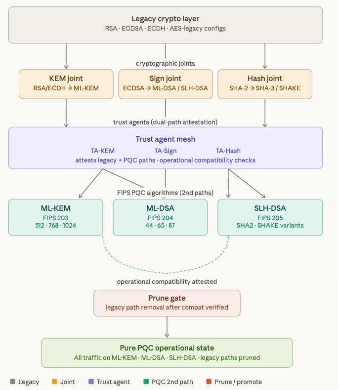

# PQC Migration Framework – Go

This is a basic mechanism of "cryptographic joints" where legacy cryptography can interface to be transferred to TA (trust agents with both options) interfacing to work as 2nd paths for pqc and attested for operational compatibility before pruning off legacy paths.

A comprehensive Go implementation of the cryptographic migration pipeline
from the diagram: **Legacy → Joints → Trust-Agent Mesh → PQC 2nd Paths → Prune Gate → Pure PQC**.

All 3 NIST/FIPS post-quantum standards are covered:

| Standard | Algorithm | Parameter Sets |
|----------|-----------|----------------|
| FIPS 203 | ML-KEM    | 512 · 768 · 1024 |
| FIPS 204 | ML-DSA    | 44 · 65 · 87 |
| FIPS 205 | SLH-DSA   | 12 variants (SHA2+SHAKE × {128,192,256} × {s,f}) |
| FIPS 202 | SHA-3/SHAKE | SHA3-{256,384,512} · SHAKE{128,256} |

---

## Architecture

```
┌────────────────────────────────────────────────────────┐
│               Legacy Crypto Layer                      │
│  RSA-2048 · ECDH-P256 · ECDSA-P384 · AES-256-GCM      │
└───────────────────┬────────────────────────────────────┘
                    │  cryptographic joints
          ┌─────────┼──────────┐
          ▼         ▼          ▼
      KEMJoint  SignJoint  HashJoint
    RSA/ECDH→  ECDSA→     SHA-2→
     ML-KEM   ML-DSA/    SHA-3/SHAKE
              SLH-DSA
          │         │          │
          └─────────┼──────────┘
                    │  trust agents (dual-path attestation)
          ┌─────────┼──────────┐
          ▼         ▼          ▼
        TA-KEM   TA-Sign    TA-Hash
          │         │          │
          └─────────┼──────────┘
                    │  FIPS PQC 2nd paths
          ┌─────────┼──────────┐
          ▼         ▼          ▼
        ML-KEM   ML-DSA     SLH-DSA
       FIPS 203  FIPS 204   FIPS 205
                    │
                    ▼
             Prune Gate
    (legacy path removal after compat verified)
                    │
                    ▼
         Pure PQC Operational State
   ML-KEM · ML-DSA · SLH-DSA · SHA-3/SHAKE
```



---

## File Layout

| File | Responsibility |
|------|----------------|
| `main.go` | Pipeline orchestration, demo round-trips |
| `legacy.go` | Legacy crypto layer (RSA, ECDH, ECDSA, AES) |
| `joints.go` | Cryptographic joints (KEM, Sign, Hash) |
| `pqc_algorithms.go` | All FIPS PQC providers + FIPS 202 hash |
| `trust_agent_mesh.go` | Trust-agent mesh + dual-path attestation |
| `prune_gate.go` | Prune gate + PurePQCState |

---

## Build & Run

Requirements: Go 1.22+ and `golang.org/x/crypto`.

```bash
git clone <repo>
cd pqc_migration
go mod tidy
go run .
```

Expected output (abbreviated):

```
[PHASE 1] Legacy Crypto Layer initialised
  RSA:   2048-bit key
  ECDH:  curve P-256
  ECDSA: curve P-384
  AES:   256-bit key  GCM=true

[PHASE 2] Wiring cryptographic joints …
  KEM   legacy=RSA/ECDH           PQC=ML-KEM (FIPS 203)          legacy_active=true  pqc_active=false
  Sign  legacy=ECDSA              PQC=ML-DSA / SLH-DSA (FIPS …)  legacy_active=true  pqc_active=false
  Hash  legacy=SHA-2              PQC=SHA-3 / SHAKE (FIPS 202)    legacy_active=true  pqc_active=false

[PHASE 3] Initialising trust-agent mesh …
[PHASE 4] Activating FIPS PQC second paths …
  [mesh] registered ML-KEM-768   → TA-KEM
  [mesh] registered ML-DSA-65    → TA-Sign
  [mesh] registered SLH-DSA-SHA2-128s → TA-Sign

[PHASE 5] Running operational compatibility attestation …
  provider                          standard   cat  leg   pqc   compat
  ML-KEM-768                        FIPS 203   3    ✓     ✓     ✓  dual-path OK
  ML-DSA-65                         FIPS 204   3    ✓     ✓     ✓  dual-path OK
  SLH-DSA-SHA2-128s                 FIPS 205   1    ✓     ✓     ✓  dual-path OK
  AllPassed=true

[PHASE 6] Prune gate evaluation …
  ✓ prune gate PASSED

[PHASE 7] Pure PQC operational state
  KEM  : ML-KEM-768     FIPS 203  cat=3
  Sign : ML-DSA-65      FIPS 204  cat=3
  SLH  : SLH-DSA-SHA2-128s FIPS 205 cat=1
  Hash : SHA3-256       FIPS 202  cat=1

[PHASE 8] Demo cryptographic round-trips …
  KEM  (ML-KEM-768): encap/decap OK=true  ss_len=32
  DSA  (ML-DSA-65): sign/verify OK=true  sig_len=3293
  Hash (SHA3-256): digest_hex=…
  SLH  (SLH-DSA-SHA2-128s): sign/verify OK=true  sig_len=7856
```

---

## Extending

### Add all 12 SLH-DSA variants

```go
variants := []SLHDSAVariant{
    SLHDSA_SHA2_128s, SLHDSA_SHA2_128f,
    SLHDSA_SHA2_192s, SLHDSA_SHA2_192f,
    SLHDSA_SHA2_256s, SLHDSA_SHA2_256f,
    SLHDSA_SHAKE_128s, SLHDSA_SHAKE_128f,
    SLHDSA_SHAKE_192s, SLHDSA_SHAKE_192f,
    SLHDSA_SHAKE_256s, SLHDSA_SHAKE_256f,
}
for _, v := range variants {
    mesh.RegisterPQCPath(NewSLHDSAProvider(v))
}
```

### All three ML-KEM variants

```go
for _, v := range []MLKEMVariant{MLKEM512, MLKEM768, MLKEM1024} {
    mesh.RegisterPQCPath(NewMLKEMProvider(v))
}
```

### Replace simulated primitives

The `Encapsulate`/`Sign`/`Hash` methods use SHA-3 as a placeholder.
Swap in a FIPS-validated library such as:

- **cloudflare/circl** – `circl/kem/kyber` (ML-KEM), `circl/sign/dilithium` (ML-DSA)
- **filippo.io/mlkem768** – production ML-KEM
- **golang.org/x/crypto/sha3** – already used for SHA-3/SHAKE (production-ready)

The interfaces (`KEMProvider`, `SignProvider`, `HashProvider`) are designed as
drop-in swap points.

---

## Security Notes

- The simulated key operations use `crypto/rand` for all randomness.
- SHA-3/SHAKE hash operations use `golang.org/x/crypto/sha3` (production-grade).
- RSA/ECDSA/ECDH operations use Go's `crypto/` standard library.
- ML-KEM and ML-DSA operations are **structurally correct simulations** —
  replace with a FIPS-validated library before deploying in a security context.
